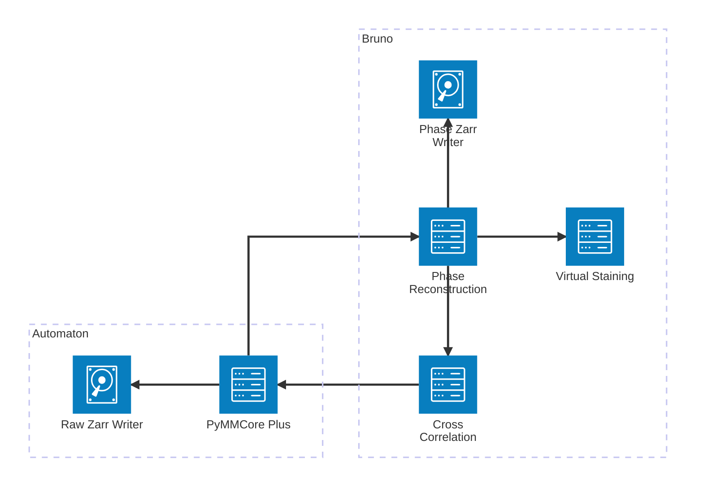

# shrimPy_ros
Basic overview of ROS2 design of ShrimPy acquisition

```mermaid
architecture-beta
    group bruno[Bruno]
    group scope[Automaton]
    
    service pymmcoreplus(server)[PyMMCore Plus] in scope
    service localstorage(disk)[Raw Zarr Writer] in scope
    service phasestorage(disk)[Phase Zarr Writer] in bruno
    service phase(server)[Phase Reconstruction] in bruno
    service staining(server)[Virtual Staining] in bruno
    service autotracker(server)[Cross Correlation] in bruno

    pymmcoreplus:T --> L:phase
    pymmcoreplus:L --> R:localstorage
    phasestorage:B <-- T:phase
    phase:R --> L:staining
    phase:B --> T:autotracker
    autotracker:L --> R:pymmcoreplus

```
