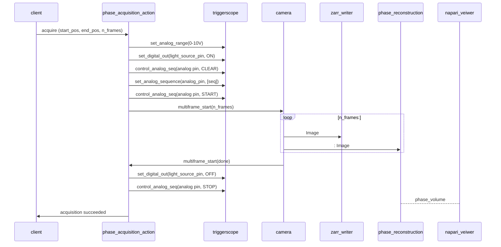

```mermaid
sequenceDiagram
    participant client
    participant phase_acquisition_action
    participant triggerscope
    participant camera

    client->>phase_acquisition_action: acquire (start_pos, end_pos, n_frames)

    phase_acquisition_action->>triggerscope: set_analog_range(0-10V)

    phase_acquisition_action->>triggerscope: set_digital_out(light_source_pin, ON)

    
    phase_acquisition_action->>triggerscope: control_analog_seq(analog pin, CLEAR)

    phase_acquisition_action->>triggerscope: set_analog_sequence(analog_pin, [seq])

    phase_acquisition_action->>triggerscope: control_analog_seq(analog pin, START) 

    phase_acquisition_action->>camera: multiframe_start(n_frames)
    
    loop n_frames:
        camera->>zarr_writer: Image
        camera->>phase_reconstruction:: Image
    end

    camera->>phase_acquisition_action: multiframe_start(done)
    

    phase_acquisition_action->>triggerscope: set_digital_out(light_source_pin, OFF)

    phase_acquisition_action->>triggerscope: control_analog_seq(analog pin, STOP)

    phase_reconstruction-->napari_veiwer: phase_volume

    phase_acquisition_action->>client: acquisition succeeded

```