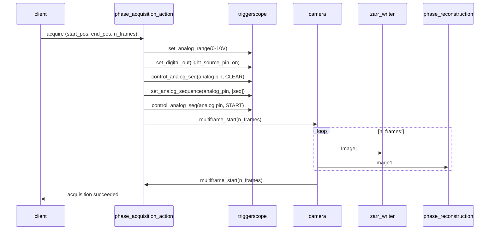

```mermaid
sequenceDiagram
    participant client
    participant phase_acquisition_action
    participant triggerscope
    participant camera

    client->>phase_acquisition_action: acquire (start_pos, end_pos, n_frames)

    phase_acquisition_action->>triggerscope: set_analog_range(0-10V)

    phase_acquisition_action->>triggerscope: set_digital_out(light_source_pin, on)

    
    phase_acquisition_action->>triggerscope: control_analog_seq(analog pin, CLEAR)

    phase_acquisition_action->>triggerscope: set_analog_sequence(analog_pin, [seq])

    phase_acquisition_action->>triggerscope: control_analog_seq(analog pin, START) 

    phase_acquisition_action->>camera: multiframe_start(n_frames)
    
    loop n_frames:
        camera->>zarr_writer: Image1
        camera->>phase_reconstruction:: Image1
    end


    camera->>phase_acquisition_action: multiframe_start(n_frames)
    
    phase_acquisition_action->>client: acquisition succeeded
%%     iframe->>viewscreen: request template
%%     viewscreen->>iframe: html & javascript
%%     iframe->>dotcom: iframe ready
%%     dotcom->>iframe: set mermaid data on iframe
%%     iframe->>iframe: render mermaid
```